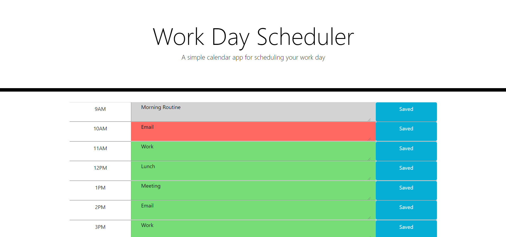

# Day-Planner

This is a simple calendar application that allows the user to save events for each hour of the typical work day.  It will utilize HTML, CSS, Javascript, and JQuery.

[Day Planner](https://kshep425.github.io/Day-Planner/)

[View Instruction Video](https://drive.google.com/file/d/1fUzGQXdAQDLlW8viNOXYWdQ8BNhlf5Wo/view)

## Description
Use this day planner to organize your day!  This will help you to stay productive and on task as the time counts down to the end of your work day.

Time that has past is displayed in gray.  The current time is displayed in red.  The future time is displayed in red.

Save any changes you make on a time block by selecting the save button next to it.  This saved locally on your computer so it can still be accessed even if the page refreshes.

## Usage
<iframe src="https://drive.google.com/file/d/1fUzGQXdAQDLlW8viNOXYWdQ8BNhlf5Wo/preview" width="640" height="480"></iframe>

Open the [Day Planner](https://kshep425.github.io/Day-Planner/) and enter things to do in a time block. When you are finished click the save button next to it.  Repeat this until you have finished entering all of the time blocks.

## Credits

* [Bootstrap4](https://www.getbootstrap.com)
* [W3Schools](https://www.w3schools.com)
* [Amazon Prime Music](https://music.amazon.com)
* Fontawesome
* Google API Swap Font
* Cloudfare AJAX
* JQuery

## License
MIT License

Copyright (c) 2019 kshep425

Permission is hereby granted, free of charge, to any person obtaining a copy
of this software and associated documentation files (the "Software"), to deal
in the Software without restriction, including without limitation the rights
to use, copy, modify, merge, publish, distribute, sublicense, and/or sell
copies of the Software, and to permit persons to whom the Software is
furnished to do so, subject to the following conditions:

The above copyright notice and this permission notice shall be included in all
copies or substantial portions of the Software.

THE SOFTWARE IS PROVIDED "AS IS", WITHOUT WARRANTY OF ANY KIND, EXPRESS OR
IMPLIED, INCLUDING BUT NOT LIMITED TO THE WARRANTIES OF MERCHANTABILITY,
FITNESS FOR A PARTICULAR PURPOSE AND NONINFRINGEMENT. IN NO EVENT SHALL THE
AUTHORS OR COPYRIGHT HOLDERS BE LIABLE FOR ANY CLAIM, DAMAGES OR OTHER
LIABILITY, WHETHER IN AN ACTION OF CONTRACT, TORT OR OTHERWISE, ARISING FROM,
OUT OF OR IN CONNECTION WITH THE SOFTWARE OR THE USE OR OTHER DEALINGS IN THE
SOFTWARE.

## Badges
N/A

## Contributing
N/A

## Tests
N/A